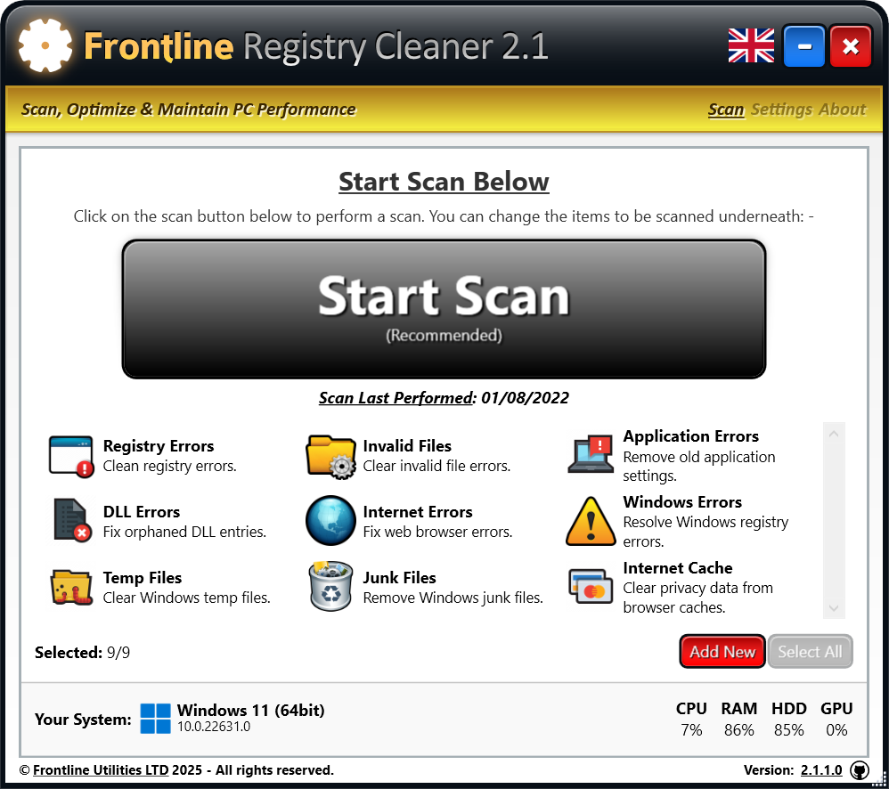

<h1 align="center">Windows® File & Registry Cleaner Software</h1>

<a href="https://www.frontlinecleaner.com">Frontline Registry Cleaner 2.1</a> is a desktop software package designed to remove bloat from Windows.

Released in 2011, it has been updated to accomodate GUI, QoL and OS updates: -

  
  

    

--

The latest version is targeted at [.NET 9](https://dotnet.microsoft.com/en-us/download/dotnet/9.0) and has an updated user interface.

After bringing development in-house in 2012, we released it open source in 2015 with the intention of continuing to develop it. We still use it and have been implementing fixes to make it compatible with the latest software.

The current version provides the ability to define scanning criteria, remove junk files & damaged registry entries and generally improve performance of a Windows® based system. We will publish the roadmap soon.

The aim of this repository is to facilitate the continual development of this tool and an outlet for experimentation from our company & the wider community.

--

The application & source code is provided 'as-is'. We accept no responsibility for its use. 

If you have any questions, you're welcome to [raise an issue](issues) or [send us an email](https://www.fl.co.uk/contact).

---

#### ⚠️ Runtime Requirements

1. [VC++ Redistributable](https://support.microsoft.com/en-us/help/2977003/the-latest-supported-visual-c-downloads) (x86 ≥ 2015)
2. [.NET Framework](https://dotnet.microsoft.com/en-us/download/dotnet-framework) (4.8+ runtime installer)

---

#### 🚦 Changelog

- [x] (04/02/2025) Upgraded to .NET 9.0
- [x] (02/04/2023) Upgraded to .NET 7.0 and changed interface
- [x] (25/01/2022) Upgraded UI to HD
- [x] (24/01/2022) Added Setup project to deploy Win32 binaries, added MSIX for Microsoft Store submission
- [x] (27/09/2020) Changed .NET target to 4.7, VS Studio 2019, Windows SDK
- [x] (01/01/2019) Removed registration engine
- [x] (17/02/2011) Major release (production)

---

#### ✔️ Contributions

To contribute, please follow the steps below:

1. Fork the repo and clone it locally
2. Make the changes you want/need
3. Commit your local repo and push to your remote repository
4. Create a PR to bring the new changes into our master branch

---

#### ⚖️ Copyrights, License etc

We own all copyrights to the user interface and product design.

By publishing the repository, and adopting the [MIT license](LICENSE), we have extended these rights to the community.

Anyone who wishes to use, adapt, change, parody or mimic the design may do so (within the scope of fair use). Any malicious interpretations of our code, engine and interface will not be tolerated and will be met with appropriate recourse. Our code is provided in good faith, as a gesture of good will to the community.

If you notice any of our products used in an illegal way, you should send an alert, either as an [issue](issues), or via our abuse email [abuse@fl.co.uk](mailto:abuse@fl.co.uk).

---

:copyright:  

<!-- ################################### -->
<!-- ################################### -->

<!-- Images -->
[fl]:   https://raw.githubusercontent.com/flutils/flcleaner/master/3.0/Private/Readme/fl.jpg
[main]: Readme/main.jpeg

<!-- Links -->
[flutils]:              http://www.fl.co.uk
[frontlinecleaner.com]: https://www.frontlinecleaner.com

<!-- ################################### -->
<!-- ################################### -->